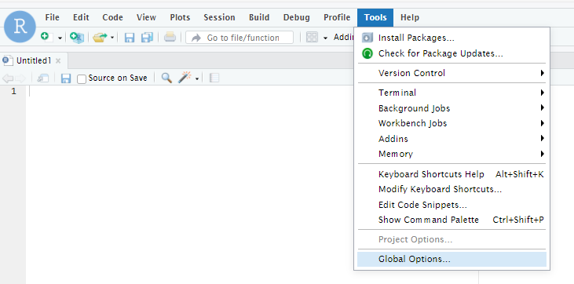
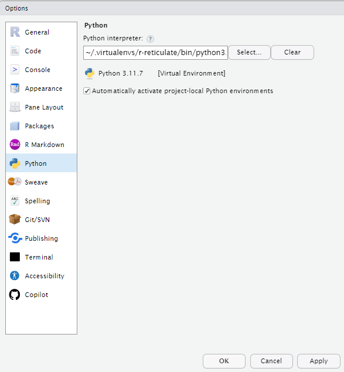
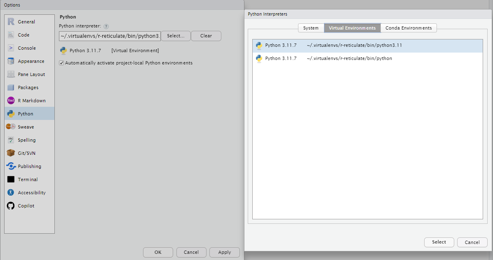

# MUFBVAR

This Python class is designed for handling and forecasting multi-frequency data.

## Class Methods

### `__init__(self, frequencies, H, nsim, nburn_perc, nlags, thining)`

Initializes the multifrequency_var object.

- `frequencies`: List of the frequencies of the data, in order lowest to highest "Y", "Q", "M", "W", "D"
- `H`: Numeric. Forecast Horizon in the highest frequency
- `nsim`: Numeric. Number of simulations
- `nburn_perc`: Numeric. Between 0 and 1, proportion of simulations to throw away as burn in.
- `nlags`: Numeric. Number of lags in the highest frequency
- `thining`: Numeric. To save only every nth draw

### `fit(self, io_data, io_conditionals, io_trans, hyp)`

Fit the specified model to the data.

### `forecast(self)`

Generates a forecast.

### `aggregate(self, frequency)`

Aggregates the Mean, Median and quantiles in the highest frequency to the desired frequency.

- `frequency`: The frequency to which the data should be aggregated to

### `save(self, filename = "mufbvar_model.pkl")`

Saves the MFBVAR Object.

- `filename`: Path where to save the object. End must be .pkl

### `to_excel(self, filename, agg = False)`

Exports the data to an Excel file.

- `agg`: Boolean. Should the aggregated series be shown
- `filename`: The name of the output file.

### `mean_plot(self,frequency, variables = "all", save = True, name = "Output", show = True)`

Generates a mean plot for the specified variables.

- `frequency`: The frequency of the data
- `variables`: List of strings. Variables for which the plot should be generated, all if it should be generated for all
- `save`: Boolean. Whether the plots should be saved. The default is True.
- `name`: String. If the plots should be saved, path/name not including filetype. The default is None.
- `show`: Boolean. Whether the plots should be shown. Default is True.

### `fanchart(self, variables = "all", save = True, name = "Fancharts", show = True, agg = True, nhist = 5)`

Generates a fan chart for the specified variables.

- `variables`: List of strings. Variables for which the plot should be generated, all if it should be generated for all
- `save`: Boolean. Whether the plots should be saved. The default is True.
- `name`: String. If the plots should be saved, path/name not including filetype. The default is None.
- `show`: Boolean. Whether the plots should be shown. Default is True.
- `nhist`: Int. Number of historical periods that should be shown on the plot. Default is 5.

## Input Data

### Frequencies

The model is implemented for the following frequencies:

- Yearly (Y)
- Quarterly (Q)
- Monthly (M)
- Weekly (W)
- Daily (D)

The frequency ratios are fixed e.g. 

- Y-Q -> frequency ratio = 4
- Q-M -> frequency ratio = 3
- M-W -> frequency ratio = 4
- W-D -> frequency ratio = 5

Hence, Y-W -> frequency ratio = 4*3*4 = 48

If other frequencies than Y,Q,M,W,D are used you will be prompted to enter the frequency ratio yourself.


### Data Files

The model takes three excel files as input:

1. History
   - Containing the historical data 
2. Conditional Forecasts
   - Containing the conditional forecasts. Set to exp() 
3. Transformation


## Use in Python

### Installation

Install package via terminal:

```console
[u80856195@workbench ~]$ pip install git+https://gitea.efv.admin.ch/efv_fs/MUFBVAR.git
```
### Example Code

``` python
from MUFBVAR.mufbvar import *

io_data = "hist.xlsx"
io_conditionals = "cond.xlsx"
io_trans = "trans.xlsx"

H = 96       # forecast horizon
nsim     = 100  # number of draws from Posterior Density
nburn    = 0.5  # number of draws to discard
nlags = [6,4]
thining = 1

hyp = (0.09, 4.3, 1, 2.7, 4.3)

model =  multifrequency_var(["Q","M", "W"], H, nsim, nburn, nlags ,thining)

model.fit(io_data, io_conditionals, io_trans, hyp = hyp)

model.forecast()

model.mean_plot(1, variables = "all", save = False, show = True)

model.fanchart(variables = "all", save = False, show = True, agg = False, nhist = 150)

```
## Use in R

### Necessary Settings

For the use in R use RStudio and perform the following steps:

1. Go to Tools -> Global Options



2. In Global Options go to the Python Tab and click on `Select...` to select the Python interpreter.



3. In the newly opened Window select the `Virtual Environments` tab and click on `select`. Then click on `Apply` in the Global Options.



### Installation

```r
library(reticulate)
system("pip install git+https://gitea.efv.admin.ch/efv_fs/MUFBVAR.git")
```

### Example Code
```r
library(reticulate)

setwd(dirname(rstudioapi::getActiveDocumentContext()$path))

mufbvar <- import("MUFBVAR.mufbvar")

io_data <- "hist.xlsx"
io_conditionals <- "cond.xlsx"
io_trans <- "trans.xlsx"

H <- 96L        # forecast horizon
nsim <- 100L  # number of draws from Posterior Density
nburn <- 0.5  # number of draws to discard
nlags <- list(6L,4L)
thining = 1

hyp <- c(0.09, 4.3, 1, 2.7, 4.3)

model <- mufbvar$multifrequency_var(list("Q","M", "W"), H, nsim, nburn, nlags ,thining)

model$fit(io_data, io_conditionals, io_trans, hyp = hyp)

model$forecast()

model$mean_plot(1L, variables = "all", save = FALSE, show = TRUE)

model$fanchart(variables = "all", save = FALSE, show = TRUE, agg = FALSE, nhist = 150L)
```